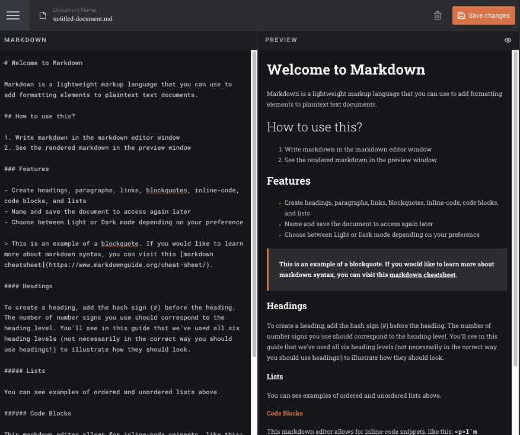

# Frontend Mentor - In-browser markdown editor solution

This is a solution to the [In-browser markdown editor challenge on Frontend Mentor](https://www.frontendmentor.io/challenges/inbrowser-markdown-editor-r16TrrQX9). Frontend Mentor challenges help you improve your coding skills by building realistic projects.

## Table of contents

- [Overview](#overview)
  - [The challenge](#the-challenge)
  - [Screenshot](#screenshot)
  - [Links](#links)
- [My process](#my-process)
  - [Built with](#built-with)
  - [What I learned](#what-i-learned)
  - [Useful resources](#useful-resources)
- [Author](#author)

## Overview

### The challenge

Users should be able to:

- Create, Read, Update, and Delete markdown documents
- Name and save documents to be accessed as needed
- Edit the markdown of a document and see the formatted preview of the content
- View a full-page preview of the formatted content
- View the optimal layout for the app depending on their device's screen size
- See hover states for all interactive elements on the page
- **Bonus**: If you're building a purely front-end project, use localStorage to save the current state in the browser that persists when the browser is refreshed
- **Bonus**: Build this project as a full-stack application

### Screenshot

### Links

- Solution URL: [Github repo](https://github.com/mrcordova/in-browser-markdown-editor)
- Live Site URL: [Github page](https://mrcordova.github.io/in-browser-markdown-editor/)

## My process

### Built with

- Semantic HTML5 markup
- CSS custom properties
- Flexbox
- CSS Grid
- Mobile-first workflow

### What I learned

I learned how to make a sidebar and how to show two windows when space is there.

If you want more help with writing markdown, we'd recommend checking out [The Markdown Guide](https://www.markdownguide.org/) to learn more.

### Useful resources

- [Have textarea take up avaible space.](https://stackoverflow.com/questions/31081320/flexbox-stretch-textarea-in-column) - This helped me stretch textarea in a flexbox.
- [Remove a key in a object](https://stackoverflow.com/questions/3455405/how-do-i-remove-a-key-from-a-javascript-object) - This helped me understand on how to safely remove a key from a object.

- [How to a dynamic fill for an inline svg element in css](https://stackoverflow.com/questions/22252472/how-can-i-change-the-color-of-an-svg-element) - How to a dynamic fill for an inline svg element in css.

- [How to add scrolling to flexbox](https://stackoverflow.com/questions/21515042/scrolling-a-flexbox-with-overflowing-content) - This helped me understand on how add scrolling to a flexbox item.

- [ReadOnly attribute](https://developer.mozilla.org/en-US/docs/Web/HTML/Attributes/readonly) - Use this to let element be focusable while not editable. Different from disabled attribute because diabled does not allow focus.

- [showdown.js library](https://showdownjs.com) - Library that converts markdown to html.

## Author

- Website - [noah ](https://noahs.software)
- Frontend Mentor - [@mrcordova](https://www.frontendmentor.io/profile/mrcordova)
